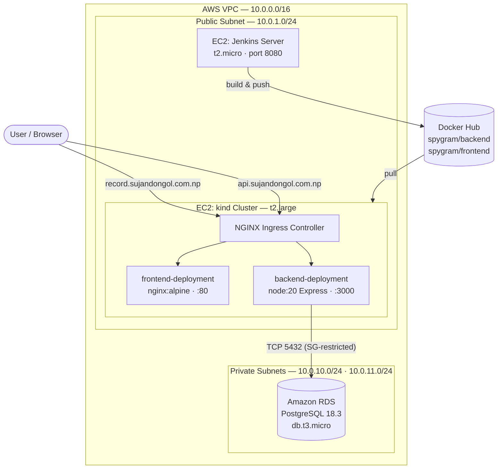

# People Record — A Three-Tier DevOps Reference Project

> An end-to-end, production-shaped deployment of a simple CRUD application — provisioned with **Terraform** on AWS, containerised with **Docker**, delivered by **Jenkins** pipelines, and served on **Kubernetes** behind an **NGINX Ingress** with real DNS.

<p align="left">
  
  
  
  
  
  
  
</p>

---

## Why this project exists

The application itself is deliberately small — add a person, list people, delete a person. That is the point. The interesting engineering is *everything around it*: how a commit becomes a running, internet-reachable service without anyone SSH-ing into a box and editing files by hand.

This repository demonstrates the full path:

**Terraform** builds the network, compute and database → **Jenkins** builds and publishes versioned images to Docker Hub → **Kubernetes manifests** roll them out onto a `kind` cluster → **NGINX Ingress** routes two public hostnames to the right service → the app talks to a **private Amazon RDS** instance that is unreachable from the internet.

| Live surface | Host | Serves |
| --- | --- | --- |
| Frontend | `record.sujandongol.com.np` | Static UI (NGINX) |
| API | `api.sujandongol.com.np` | Express JSON API |

---

## Architecture at a glance



The security posture is the part worth reading twice: the database sits in private subnets with **no public accessibility**, and its security group only accepts traffic on `5432` from the cluster's security group — not from a CIDR range, but from a specific SG identity. The cluster node itself is reachable on `22` only from the Jenkins security group.

---

## Tech stack

| Layer | Technology | Notes |
| --- | --- | --- |
| Infrastructure as Code | Terraform `~> 6.47` (AWS provider) | Remote state in S3, encrypted |
| Cloud | AWS — VPC, EC2, RDS, IGW, Security Groups | Free-tier shaped, `us-east-1` |
| Compute | Ubuntu 24.04 LTS (Noble), auto-selected AMI | Jenkins on `t2.micro`, cluster on `t2.large` |
| Database | Amazon RDS for PostgreSQL 18.3 | Private, 20 GB gp3, SG-scoped access |
| Backend | Node.js 20 · Express 5 · `pg` · `cors` · `dotenv` | Self-initialising schema with retry/backoff |
| Frontend | Vanilla HTML/CSS/JS on `nginx:alpine` | Zero build step, ~4 KB payload |
| Containers | Docker, Docker Compose | Multi-tag publishing to Docker Hub |
| CI/CD | Jenkins declarative pipelines | Parent pipeline fans out to two children |
| Orchestration | Kubernetes via `kind` (v0.32.0) | 1 control plane + 3 workers |
| Ingress | ingress-nginx v1.15.1 | Host-based routing, `nginx` IngressClass |

---

## Repository layout

```
people_record/
├── backend/                    # Express API
│   ├── app.js                  # Routes, pool, schema bootstrap
│   ├── Dockerfile              # node:20.19 image
│   └── Jenkinsfile             # Build → tag → push spygram/backend
├── public/                     # Static frontend
│   ├── index.html              # UI + fetch calls to the API
│   ├── styles.css
│   ├── Dockerfile              # nginx:alpine image
│   └── Jenkinsfile             # Build → tag → push spygram/frontend
├── infrastructure/             # Terraform (AWS)
│   ├── provider.tf             # Providers + S3 remote backend
│   ├── variables.tf            # Tunables + generated DB password
│   ├── network.tf              # VPC, subnets, IGW, route tables, DB subnet group
│   ├── compute.tf              # Key pair, security groups, both EC2 instances
│   ├── rds.tf                  # PostgreSQL instance + its security group
│   ├── data.tf                 # AMI / AZ / IAM profile lookups
│   ├── install_jenkins.sh      # Provisioner: JDK 21 + Jenkins
│   └── install_docker_kind.sh  # User data: Docker + kind + kubectl + cluster
├── k8s/                        # Kubernetes manifests
│   ├── backend.yaml            # Deployment + Service + Ingress
│   ├── frontend.yaml           # Deployment + Service + Ingress
│   ├── configmap.yaml          # Non-secret DB connection values
│   ├── configsecret.yaml       # DB credentials (Opaque Secret)
│   └── nginx-ingresscontroller.yaml
├── docker-compose-deploy.yaml  # Alternative single-host deployment
├── Jenkinsfile                 # Orchestrator pipeline
└── docs/                       # Full documentation (start here)
```

---

## Documentation

| Document | What it covers |
| --- | --- |
| [**Architecture**](docs/ARCHITECTURE.md) | Network topology, security model, request lifecycle, design decisions |
| [**Deployment**](docs/DEPLOYMENT.md) | Provisioning with Terraform, both deployment paths, DNS, teardown |
| [**API Reference**](docs/API.md) | Every endpoint, schemas, status codes, `curl` examples |
| [**CI/CD Pipelines**](docs/CICD.md) | Jenkins topology, credentials, image tagging, stage-by-stage walkthrough |

---

## Quick start (local)

Run the whole stack on your machine against a local PostgreSQL:

```bash
# 1. Database
docker run -d --name pg -e POSTGRES_PASSWORD=postgres -p 5432:5432 postgres:16

# 2. Environment — create .env in the repository root
cat > .env <<'EOF'
DB_HOST=localhost
DB_PORT=5432
DB_USER=postgres
DB_PASSWORD=postgres
DB_NAME=postgres
PORT=3000
EOF

# 3. Backend
cd backend && npm install && node app.js
```

The API comes up on `http://localhost:3000` and creates the `person` table on first boot. To exercise the UI locally, open `public/index.html` and point `API_BASE` at `http://localhost:3000`.

> **Note on TLS** — the connection pool sets `ssl.rejectUnauthorized: false`, which matches Amazon RDS's default certificate chain. Against a plain local Postgres you may want to drop the `ssl` block.

---

## Environment variables

| Variable | Required | Description | Example |
| --- | --- | --- | --- |
| `DB_HOST` | yes | PostgreSQL host — the RDS endpoint in AWS | `dev-postgres.xxxx.us-east-1.rds.amazonaws.com` |
| `DB_PORT` | yes | Database port | `5432` |
| `DB_USER` | yes | Master username | `dbadmin` |
| `DB_PASSWORD` | yes | Master password (Terraform-generated) | — |
| `DB_NAME` | yes | Database name | `pplmgtdb` |
| `PORT` | no | Port the API listens on (default `3000`) | `3000` |
| `APP_SERVER` | compose only | Target host for the Compose rollout | `10.0.1.101` |
| `APP_PORT` | compose only | Host port mapped to the backend | `3000` |

Secrets are never committed — `.env`, `*.pem`, `*.tfstate` and `backend/db-config.json` are all git-ignored. Terraform generates the database password with `random_password` and writes the connection details to `backend/db-config.json` locally.

---

## Highlights

- **Zero-touch provisioning.** `terraform apply` produces a Jenkins controller *and* a four-node Kubernetes cluster, both fully configured by provisioners and user data — no manual installs.
- **Fan-out CI/CD.** The orchestrator pipeline triggers backend and frontend builds *in parallel*, waits for both, then performs a single atomic rollout.
- **Immutable, traceable images.** Every build publishes `0.0.${BUILD_NUMBER}` alongside `latest`, so any deployment can be traced back to the exact Jenkins run that produced it.
- **Defence in depth.** Private-subnet database, security-group-to-security-group rules, no public IP on the data tier, generated credentials.
- **Resilient startup.** The API retries the database connection ten times with backoff before exiting, so pod/container start order never causes a failed deploy.
- **Two deployment targets, one artefact set.** The same Docker Hub images run either on Kubernetes or via Docker Compose on a single host.

---

## Author

**Sujan Dongol**

- Live demo — [record.sujandongol.com.np](https://record.sujandongol.com.np)
- API — [api.sujandongol.com.np](https://api.sujandongol.com.np)
- GitHub — [@Spygram](https://github.com/Spygram)
- Docker Hub — [spygram](https://hub.docker.com/u/spygram)
