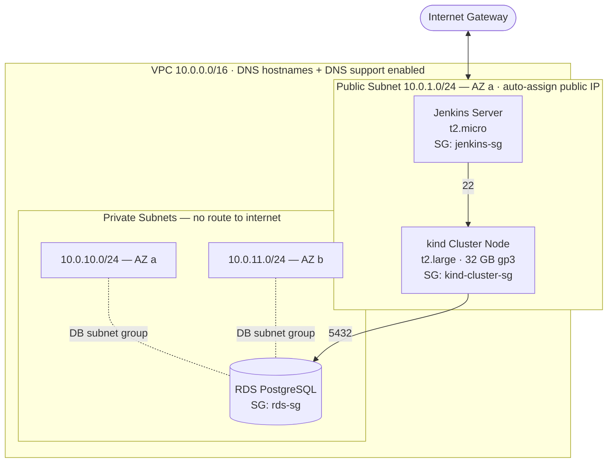
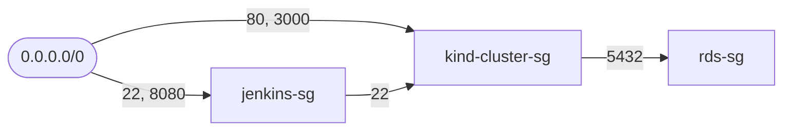
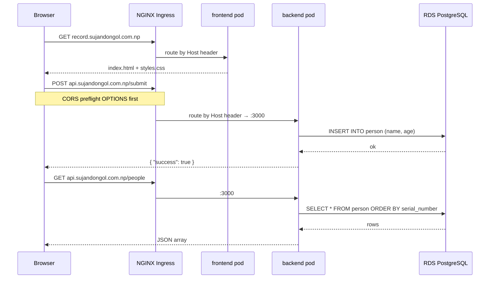
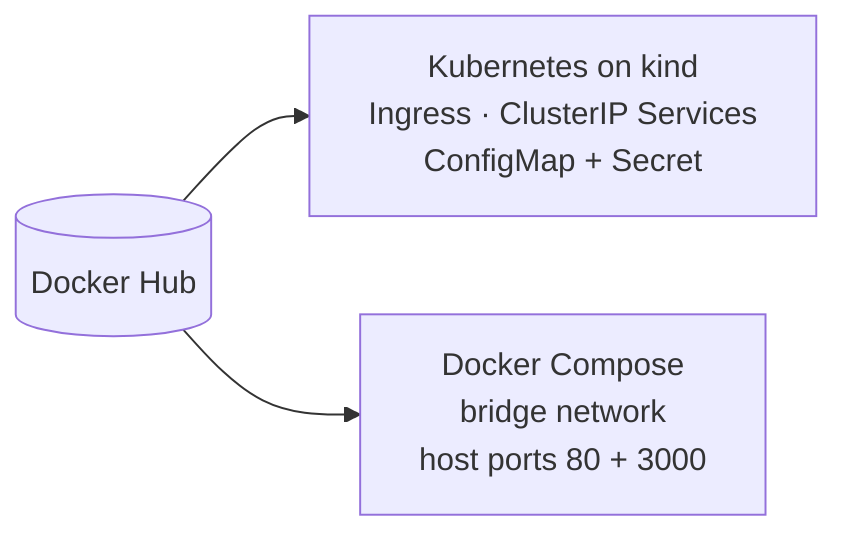

# Architecture

This document explains how People Record is put together — the network topology, the security model, how a request flows from a browser to the database, and why the pieces were chosen.

---

## 1. The three tiers

| Tier | Component | Placement | Exposure |
| --- | --- | --- | --- |
| Presentation | Static HTML/CSS/JS served by `nginx:alpine` | Kubernetes pod, public subnet host | Public — `record.sujandongol.com.np` |
| Application | Express 5 API on Node.js 20 | Kubernetes pod, public subnet host | Public — `api.sujandongol.com.np` |
| Data | Amazon RDS for PostgreSQL 18.3 | Private subnets, two AZs | Private — no public IP, SG-scoped |

The separation is real, not cosmetic. The frontend is a pure static artefact with no server-side logic; it never holds credentials and talks to the API over CORS. The API is the only component that holds database credentials, and the database can only be reached from one specific security group.

---

## 2. Network topology



**Public subnet** — one `/24` in the first available AZ, associated with a route table carrying a `0.0.0.0/0` route to the Internet Gateway. Both EC2 instances live here because both need outbound internet access (apt, Docker Hub, GitHub) and inbound access (Jenkins UI, application traffic).

**Private subnets** — two `/24`s spread across the first two availability zones. They are associated with a route table that has *no* internet route, which is what makes them private. RDS requires a DB subnet group spanning at least two AZs, which is why there are two.

**Why the database spans two AZs** — Amazon RDS mandates a multi-AZ subnet group even for single-AZ instances. It also means enabling Multi-AZ failover later is a one-line change rather than a network redesign.

---

## 3. Security model

Security groups are chained by *identity* rather than by CIDR wherever possible. This is the single most important design decision in the infrastructure:



| Security group | Inbound | Source |
| --- | --- | --- |
| `jenkins-sg` | `22` (SSH), `8080` (Jenkins UI) | `0.0.0.0/0` |
| `kind-cluster-sg` | `22` (SSH) | **`jenkins-sg`** — not the internet |
| `kind-cluster-sg` | `80` (Ingress), `3000` (API) | `0.0.0.0/0` |
| `rds-sg` | `5432` (PostgreSQL) | **`kind-cluster-sg`** — not a CIDR |

The consequence: even if someone learns the RDS endpoint, there is no network path to it. Traffic must originate from an instance carrying `kind-cluster-sg`. Likewise, the cluster node cannot be SSH-ed into from the open internet — only from the Jenkins host, which is what the deployment pipeline does.

Additional controls:

- **Generated credentials.** The database password is created by Terraform's `random_password` (20 characters, constrained special set) and never appears in source. It is written to the git-ignored `backend/db-config.json`.
- **Generated SSH keys.** An ED25519 key pair is created by the `tls` provider at apply time; the private key lands locally as `<env>-key.pem` with mode `0600`, and `*.pem` is git-ignored.
- **Encrypted remote state.** Terraform state lives in the S3 bucket `3-tier-project-statefile` under `vpc/terraform.tfstate` with `encrypt = true`, keeping the generated password out of any local working copy.
- **IAM by instance profile.** Both instances attach the existing `LabInstanceProfile` rather than embedding keys.

---

## 4. Request lifecycle

What actually happens when someone adds a person:



Two hostnames resolve to the same cluster node. The Ingress controller inspects the `Host` header and dispatches to `frontend-service:80` or `backend-service:3000` accordingly — a single ingress controller, a single public IP, two logical applications.

Because the frontend is served from a different origin than the API, the backend enables CORS for `GET`, `POST`, `DELETE` and `OPTIONS` with a `Content-Type` allowlist.

---

## 5. Application design

### Schema bootstrap with retry

The API owns its own schema. On startup it runs:

```sql
CREATE TABLE IF NOT EXISTS person (
  serial_number SERIAL PRIMARY KEY,
  name TEXT,
  age  INT
);
```

wrapped in a retry loop — **ten attempts, three seconds apart**, exiting non-zero only if all fail. This matters in both deployment models: on Kubernetes a pod may start before the database accepts connections, and under Docker Compose there is no true readiness gate. Rather than depending on orchestrator-level ordering, the application makes itself tolerant of it. A crashed process after exhausting retries is also the correct signal — Kubernetes will restart the pod and try again.

### Connection pooling

A single `pg.Pool` is created at module load and reused for every request, so connections are not opened per-request. TLS is enabled with `rejectUnauthorized: false`, matching Amazon RDS's default certificate chain.

### Stateless by construction

The API holds no session state, no local files, and no in-memory cache. All state lives in RDS. That is what makes `replicas: N` a safe change and what allows the Compose deployment to `down`/`up` without data loss.

---

## 6. Kubernetes objects

| File | Objects | Purpose |
| --- | --- | --- |
| `k8s/configmap.yaml` | `ConfigMap/app-config` | `DB_HOST`, `DB_PORT`, `DB_NAME` — non-secret connection values |
| `k8s/configsecret.yaml` | `Secret/db-secret` (Opaque) | `DB_USER`, `DB_PASSWORD` |
| `k8s/backend.yaml` | `Deployment`, `Service` (ClusterIP :3000), `Ingress` | API, injected with config + secret via `valueFrom` |
| `k8s/frontend.yaml` | `Deployment`, `Service` (ClusterIP :80), `Ingress` | Static UI |
| `k8s/nginx-ingresscontroller.yaml` | Namespace, RBAC, controller Deployment, admission webhook, `IngressClass/nginx` | Upstream ingress-nginx v1.15.1 |

Configuration is split deliberately: anything non-sensitive goes in the ConfigMap so it can be reviewed in a pull request, while credentials go in the Secret. The backend Deployment pulls each variable individually with `configMapKeyRef` and `secretKeyRef`, which makes the dependency explicit in the manifest.

Both Services are `ClusterIP` — nothing is exposed via `NodePort` or `LoadBalancer`. The only ingress path into the cluster is the NGINX controller, giving one place to add TLS, rate limiting or auth later.

### Why `kind` rather than EKS

`kind` runs a four-node cluster (one control plane, three workers) inside Docker on a single `t2.large`. For a portfolio deployment this delivers genuine multi-node Kubernetes semantics — scheduling, rolling updates, service discovery, ingress — at roughly the cost of one EC2 instance instead of an EKS control-plane charge plus a managed node group. The manifests are vanilla Kubernetes and would apply unchanged to EKS.

---

## 7. Deployment topologies

The same images support two targets:



**Kubernetes** is the primary path — declarative manifests, host-based ingress routing, config/secret separation.

**Docker Compose** (`docker-compose-deploy.yaml`) is the lightweight path: two services on a bridge network, `restart: always`, frontend depending on backend, environment supplied from a `.env` file shipped alongside. It is what the orchestrator Jenkins pipeline uses for its single-host rollout.

Keeping both working means the build stage stays orchestrator-agnostic — the artefact is just a tagged image.

---

## 8. Design decisions summary

| Decision | Rationale |
| --- | --- |
| Database in private subnets, SG-to-SG rules | No network path from the internet to the data tier |
| Terraform-generated password, S3 remote state | Credentials never enter source control or a laptop |
| Schema bootstrap in the app with retries | Removes startup-order coupling between app and database |
| ClusterIP + single Ingress | One controlled entry point; TLS and policy attach in one place |
| Parallel child pipelines, sequential deploy | Fast feedback on builds, atomic rollout |
| `0.0.${BUILD_NUMBER}` plus `latest` | Every running container traces back to a specific Jenkins run |
| Vanilla frontend, no framework | Nothing to build; the payload is a few KB and the focus stays on delivery |
| `kind` instead of EKS | Real multi-node Kubernetes semantics at single-instance cost |
