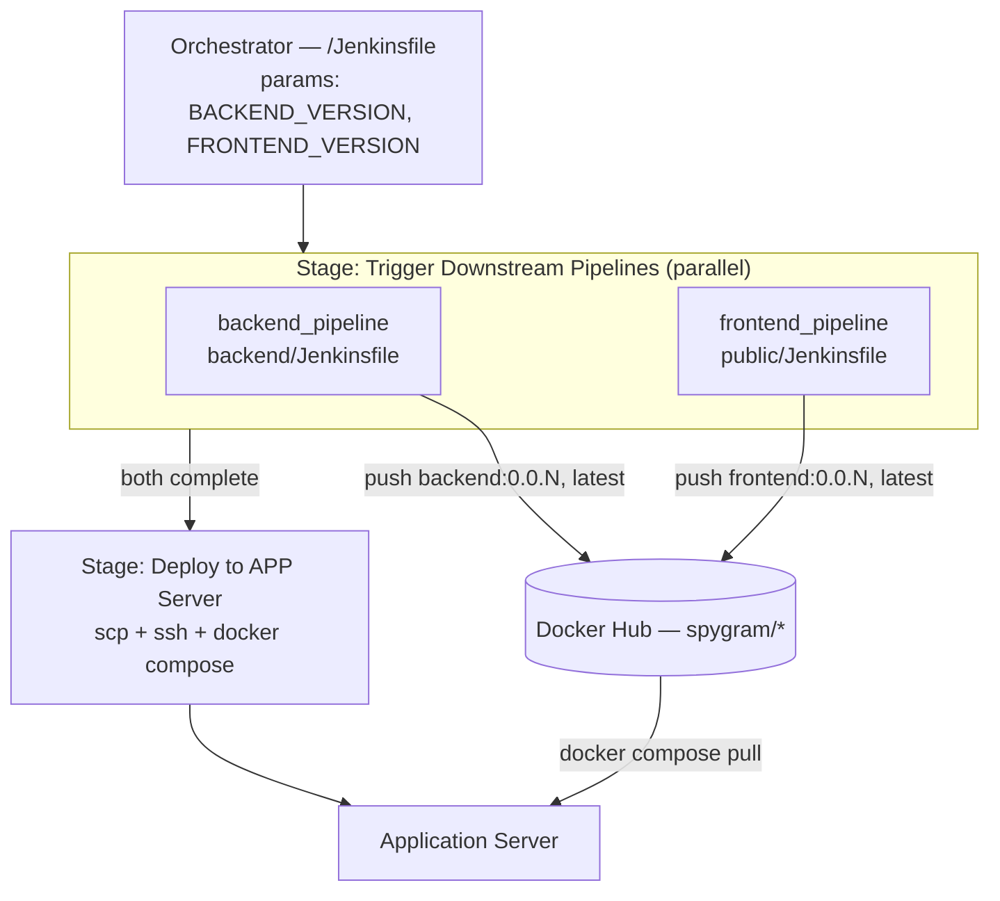
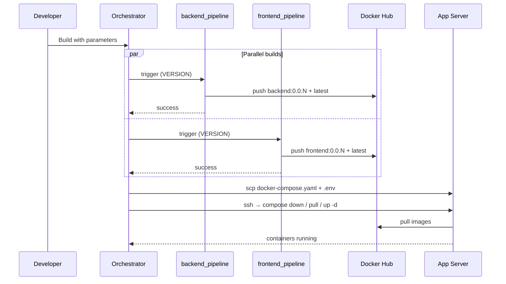

# CI/CD Pipelines

Three Jenkins declarative pipelines deliver the application: two build pipelines that produce container images, and one orchestrator that coordinates them and performs the rollout.

---

## Topology



The two build pipelines run **concurrently** and the orchestrator blocks on both (`wait: true`) before deploying. Builds are independent, so parallelising them roughly halves wall-clock time; the deploy must not start until both images exist, so it is strictly sequential after the fan-in.

---

## Jenkins setup

### Credentials

| ID | Kind | Consumed by |
| --- | --- | --- |
| `dockerhub_credential` | Username with password | `backend/Jenkinsfile`, `public/Jenkinsfile` |
| `appserverkey` | SSH username with private key | Root `Jenkinsfile` deploy stage |

Neither pipeline ever echoes a secret. The Docker Hub password is piped through `--password-stdin` so it never appears in `ps` output or the build log, and the SSH key is exposed only as a temporary file path via `keyFileVariable`.

### Jobs

| Job name | Definition | Notes |
| --- | --- | --- |
| `backend_pipeline` | Pipeline script from SCM → `backend/Jenkinsfile` | Name must match exactly |
| `frontend_pipeline` | Pipeline script from SCM → `public/Jenkinsfile` | Name must match exactly |
| Orchestrator | Pipeline script from SCM → `Jenkinsfile` | Any name |

The orchestrator references its children by literal string in `build job:`, so renaming either child breaks the trigger.

### Agent requirements

All three pipelines declare `agent any`, so the controller (or any attached agent) must have:

- Docker CLI with daemon access — the `ubuntu` user is added to the `docker` group by `install_docker_kind.sh` on the cluster host; the Jenkins host needs the equivalent for its own builds
- `scp` and `ssh`
- Network reachability to Docker Hub and to `APP_SERVER` on port 22

---

## Build pipelines

`backend/Jenkinsfile` and `public/Jenkinsfile` are structurally identical, differing only in image name and build context.

### Environment

```groovy
IMAGE_REPO = 'spygram'
IMAGE_TAG  = "0.0.${env.BUILD_NUMBER}"
```

### Stage 1 — Login to Docker Hub

```groovy
withCredentials([usernamePassword(credentialsId: 'dockerhub_credential',
                                  usernameVariable: 'USERNAME',
                                  passwordVariable: 'PASSWORD')]) {
    sh 'echo $PASSWORD | docker login -u $USERNAME --password-stdin'
}
```

Note the single quotes — the credentials are interpolated by the shell, not by Groovy, which keeps them out of the Jenkins console log.

### Stage 2 — Build and push

| Pipeline | Build context | Tags pushed |
| --- | --- | --- |
| `backend_pipeline` | `./backend` | `spygram/backend:0.0.${BUILD_NUMBER}`, `spygram/backend:latest` |
| `frontend_pipeline` | `./public` | `spygram/frontend:0.0.${BUILD_NUMBER}`, `spygram/frontend:latest` |

```bash
docker build -t $IMAGE_REPO/backend:$IMAGE_TAG -t $IMAGE_REPO/backend:latest ./backend
docker push  $IMAGE_REPO/backend:$IMAGE_TAG
docker push  $IMAGE_REPO/backend:latest
```

**Dual tagging** is the key practice here. `latest` gives deployment manifests a stable reference, while `0.0.${BUILD_NUMBER}` gives every image an immutable identity tied to the exact Jenkins run that produced it — so any running container can be traced back to a build, and rollback is a matter of pinning a previous number.

### Post actions

Both pipelines report on `success` and `failure`, giving a clear terminal signal in the console and in any notification integration.

---

## Orchestrator pipeline

### Parameters

| Parameter | Default | Purpose |
| --- | --- | --- |
| `BACKEND_VERSION` | `latest` | Passed to `backend_pipeline` as `VERSION` |
| `FRONTEND_VERSION` | `latest` | Passed to `frontend_pipeline` as `VERSION` |

### Environment

```groovy
APP_SERVER = "10.0.1.242"
```

The **private** IP of the deployment target inside the VPC. Traffic never leaves the VPC, and the target needs no public SSH exposure.

### Stage 1 — Trigger downstream pipelines

```groovy
parallel {
    stage('Trigger Backend Pipeline') {
        steps {
            build job: 'backend_pipeline',
                  parameters: [string(name: 'VERSION', value: params.BACKEND_VERSION)],
                  wait: true
        }
    }
    stage('Trigger Frontend Pipeline') { /* ... frontend_pipeline ... */ }
}
```

`wait: true` on both branches is what makes the fan-in work: if either child fails, the parallel stage fails and the deploy never runs. A broken build cannot reach the application server.

### Stage 2 — Deploy to app server

```groovy
withCredentials([sshUserPrivateKey(credentialsId: 'appserverkey',
                                   keyFileVariable: 'SECURE_SSH_KEY',
                                   usernameVariable: 'SSH_USER')]) { ... }
```

The stage then:

1. `chmod 400` the injected key — SSH refuses keys with loose permissions.
2. `scp` the Compose file to `~/docker-compose.yaml` on the target.
3. `scp` the `.env` file carrying database credentials and image versions.
4. `ssh` in and run the rollout:

```bash
docker compose down
sleep 5
docker compose pull
docker compose up -d --remove-orphans
```

`StrictHostKeyChecking=no` keeps the non-interactive session from stalling on an unknown-host prompt. The `sleep 5` gives containers time to release ports before the new set binds them. `--remove-orphans` cleans up services that no longer exist in the Compose file, so the running state always matches the declared state.

---

## Deployment flow end to end



---

## Design notes

**Why a parent/child split rather than one pipeline?** The build pipelines are independently useful — you can rebuild just the frontend without touching the API or triggering a deploy. The orchestrator composes them. This also keeps each `Jenkinsfile` next to the code it builds, so a change to the backend Dockerfile and a change to its build steps land in the same directory and the same review.

**Why `docker compose` over SSH rather than a Kubernetes rollout?** The Compose path is the lightweight single-host target. The Kubernetes path is applied declaratively from the manifests in `k8s/`. Because the build stage only produces tagged images, the same artefacts feed either target — the pipeline is deliberately orchestrator-agnostic up to the final stage.

**What ties a running container to its source?** The `0.0.${BUILD_NUMBER}` tag. Given a container, you can read its tag, open that Jenkins build, and see the exact commit it was built from.

---

## Extending the pipeline

Natural next steps, in rough order of value:

| Addition | Where it fits |
| --- | --- |
| Automated tests | New stage before `Docker build`; `backend/package.json` currently has no test script |
| Image vulnerability scanning | Trivy or Snyk between build and push |
| Kubernetes rollout stage | `kubectl set image` + `kubectl rollout status` as an alternative to the Compose deploy |
| Git-SHA tagging | Add `${GIT_COMMIT}` alongside the build number for direct commit traceability |
| Slack / email notifications | Extend the existing `post` blocks |
| Automatic rollback | On failed `rollout status`, `kubectl rollout undo` |
| Webhook triggers | Replace manual builds with GitHub push triggers |
| Approval gate | An `input` step before the production deploy stage |
